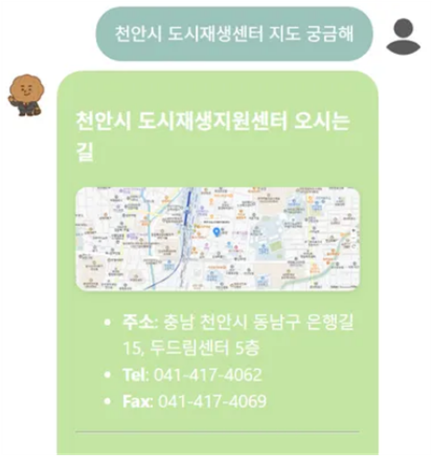

### 🏙️ 천안 도시재생지원센터 챗봇 서비스

  <h1>호동이 챗봇</h1>
  
🤖 천안 도시재생지원센터 맞춤형 챗봇 서비스 🤖

 

  

 

  <a href="https://www.cheonan.go.kr/">천안시청 홈페이지</a>
  &nbsp; | &nbsp;
  <a href="https://www.cheonan.go.kr/urc.do">도시재생지원센터</a>
  &nbsp; | &nbsp;
  <a href="https://www.notion.so/">Notion</a>

---

## ✍️ 프로젝트 개요

- **프로젝트명:** 천안 도시재생지원센터 챗봇 (호동이 챗봇)
- **프로젝트 기간:** 2024.07 ~ 2024.08
- **프로젝트 형태:** 공공기관 연계 프로젝트
- **목표:** 방문객·시민이 센터의 정보(인사말, 조직 및 담당, 사업소개, 오시는 길 등)를 쉽고 빠르게 확인할 수 있도록 돕는 맞춤형 챗봇 서비스
- **주요 타겟 사용자:** 천안시 도시재생 관련 주민, 방문객, 관계자

---

## ✍️ 프로젝트 소개

### 프로젝트 배경

도시재생지원센터는 다양한 정보(센터 소개, 사업 안내, 공지사항 등)를 제공하지만, 웹사이트 구조상 원하는 정보를 빠르게 찾기 어려운 경우가 있음.  

또한, 기존 정보 제공 방식에는 다음과 같은 문제가 존재함:
1. **시민 정보 접근성 저하** – 원하는 정보를 찾기 위해 여러 메뉴 탐색이 필요  
2. **행정업무 과부하** – 반복적인 민원 응대에 행정 인력이 소모  
3. **정보 전달의 비효율성** – 전화·현장·온라인 등 채널이 분산되어 즉각적 확인이 어려움  

이를 해결하기 위해 **호동이 챗봇**은 사용자의 질문을 이해하고, 관련 정보를 신속하게 제공하여 **시민 친화적인 정보 접근성**을 높이고자 함.

---

### 문제점 해결

- **대화형 AI 챗봇 구축**  
  FAQ, RAG, 웹 검색을 결합한 다층 응답 구조 설계.  
- **사용자 친화적 UI 제공**  
  텍스트 입력 + 음성(STT/TTS) 기반 지원.  
- **안정적인 서비스 운영**  
  FastAPI 기반 백엔드, Redis 캐시, Orchestrator 적용으로 안정적 서비스 제공.

---

## 🚀 프로젝트 목표

1. **정보 접근 편의성 향상**
   - 주민들이 센터 정보를 빠르고 쉽게 확인 가능
   - 담당자에게 직접 문의하는 불편 최소화

2. **사용자 경험 개선**
   - 직관적인 챗봇 인터페이스 제공
   - 카테고리 버튼 선택과 자연어 입력 모두 지원

3. **행정 효율성 제고**
   - 반복적인 민원 응대 부담 완화
   - 담당자의 업무 효율성 증대

4. **지역사회 기여도**
   - 주민 참여 확대
   - 도시재생사업 홍보 및 활성화

---

## 📌 주요 기능

### **1. 센터 소개 정보 제공**
- 인사말, 조직 및 담당, 센터 연혁, 목표 및 비전 확인 가능

  

---

### **2. 사업 안내**
- 진행 중인 도시재생사업 개요 제공
- 지역별 사업 내용 요약

  

  

---

### **3. 위치 및 방문 안내**
- 오시는 길, 주소 안내
- 지도 링크 제공

  

---

### **4. 공지사항 및 소식**
- 센터의 최신 공지사항 및 행사 일정 안내

  

---

### **5. 버튼 기반 간편 탐색**
- 인사말 / 공지사항 / 사업소개 / 오시는 길 등 주요 메뉴 버튼 제공

  

---

## 🎯 기대효과

1. **정보 접근성 향상**  
   시민이 언제 어디서든 편리하게 필요한 정보를 확인  
2. **행정 효율성 증대**  
   반복 민원 대응 자동화로 업무 부담 완화  
3. **시민 만족도 증대**  
   빠른 응답 제공으로 사용자 경험 개선  
4. **지역사회 기여도**  
   주민 참여와 사업 활성화로 도시재생 효과 극대화  

---

## 🔮 향후 확장 가능성
- **기능 고도화**: 다국어 챗봇, FAQ 자동 학습  
- **서비스 연계**: 도시재생 플랫폼, SNS, 외부 민원 시스템과 연동  
- **운영 체계 발전**: 지자체 기반 커뮤니티 운영, 데이터 기반 정책 지원  
- **확산 가능성**: 타 지자체, 교육 등 다양한 분야로 확장 가능  

---

## 🧑‍💻 팀원 소개

| **이름**   | **역할**              | **담당 업무** |
|:----------:|:---------------------:|---------------|
| 김경민      | TL / Frontend-Backend                | 프로젝트 총괄 기획, 지자체·유관기관 컨택, 데이터 수집 및 가공, 프론트/백엔드 개발 |
| 김범진      | AI / Data & Backend   | 지자체·유관기관 컨택, 데이터 수집 및 가공, 백엔드 개발, 발표 |
| 양상연      | Frontend              | 프론트엔드 개발, UI 설계, 사용자 인터페이스 구현 |
| 조예림      | Backend               | 백엔드 개발, UI 설계 |

---

## ⚙️ 기술 스택

<table>
  <thead>
    <tr>
      <th>분류</th>
      <th>기술 스택</th>
    </tr>
  </thead>
  <tbody>
    <tr>
      <td>프론트엔드</td>
      <td>
        
        
        
        
        
      </td>
    </tr>
    <tr>
      <td>백엔드</td>
      <td>
        
        
        
        
        
      </td>
    </tr>
  </tbody>
</table>
